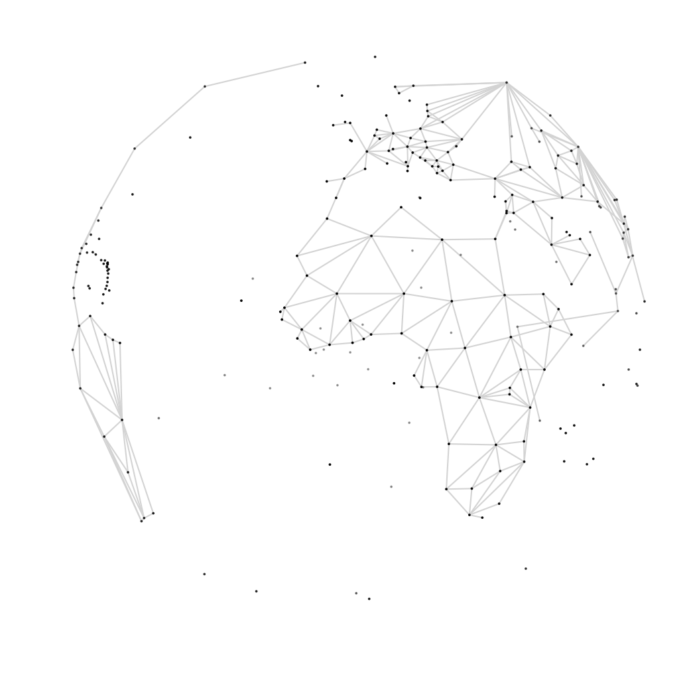
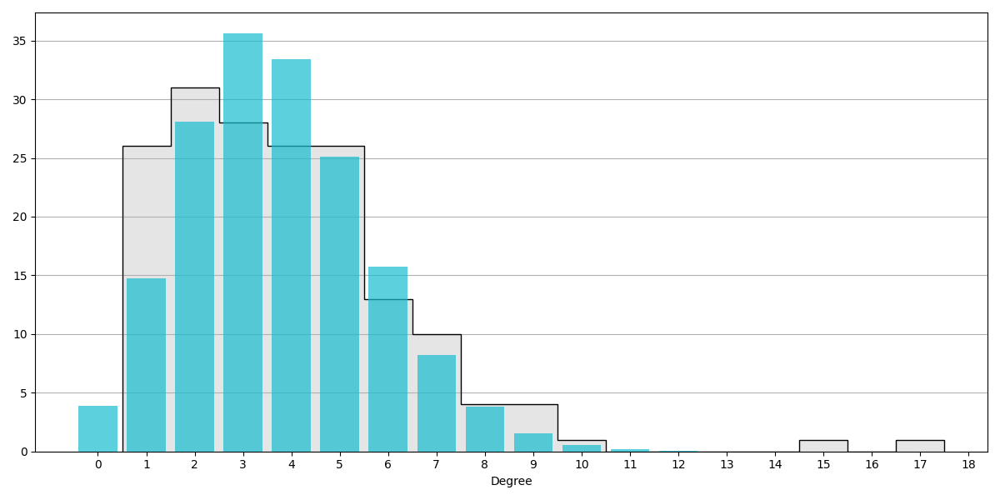

# Geographic graphs

  

This repository is an attempt to recreate the map graph of countries worldwide with random graph models. By map graph of countries we mean the graph with nodes corresponding to the centroids of a selection of 250 countries and territories (See Section Report for more info), where a pair of nodes is connected is they share a border. The random graphs are created by sampling uniformly distributed nodes on a sphere, and connecting them according to rules defined by various random graph models. The available random graph models are:

- Epsilon neighborhood graph
- (Mutual) K-nearest neighbors graph
- Delaunay triangulation
- Minimum spanning tree
- Relative neighborhood graph
- Beta skeleton

There are various ways of generating plots of graph embeddings (Mercator projection, stereographic projection, 3D animation).

## Running the code

'main.py' can be used to tie together the methods from the other classes, and
generate results (text, maps, plots).

## Organization of the code

'data.py' is used to load the datasets.

'graph.py' contains methods to convert loaded data into graphs, and a variety of graph operations.

'plots.py' contains methods for generating maps of clustered countries, and 2D plots or 3D animations of graphs embedded on the Earth surface.

'randomgraph.py' contains methods for generating random graphs according to a variety of models, particularly focused on geometric models generated on uniformly distributed vertices on the Earth surface.

## Datasets

The project builds on the following datasets:

 - Bordering countries: [country-borders](https://github.com/geodatasource/country-borders/blob/master/GEODATASOURCE-COUNTRY-BORDERS.CSV).
 - Cities: [simplemaps](https://simplemaps.com/data/world-cities), download the free 'Basic' CSV file.
 - Country centroids: [world-countries-centroids](https://github.com/gavinr/world-countries-centroids/blob/master/dist/countries.csv), four entries were incompatible with the other datasets and added manually from [countries_csv](https://developers.google.com/public-data/docs/canonical/countries_csv).
 - Road network: [SEDAC](https://sedac.ciesin.columbia.edu/data/set/groads-global-roads-open-access-v1), requires login. Although the code is by default designed for the Global GeoDataBase, you can download any of the other available GeoDataBases and adjust the 'self.road_file' in the 'data.py' file.

Put the files into a folder called 'data' in the repository.

## Images

   
  <em>Sample ε-neighborhood graph, ε=1900 km.</em>

   
  <em>Average degree distribution ε-neighborhood graph, ε=1900 km.</em>

## Report

Click [here](https://www.overleaf.com/read/xzbmhvwgfgqz) for the LaTeX overleaf file of the report.
